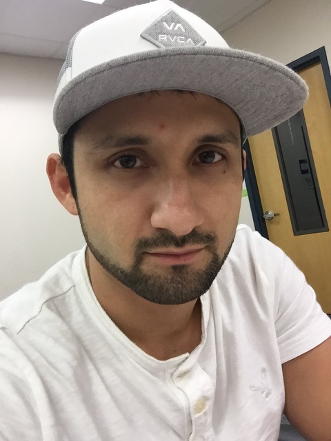

<html>
    <head>
        <meta lang="en-US">
        <meta charset="utf-8">
        <meta name="viewport" content="width=device.width initial-scale=1">
    
        <title>Cesar Jaimes</title>
        <link rel="stylesheet" href="main.css">
        
    </head>

    <body>
        

        

        

            <h1> Cesar Jaimes </h1>
            
            <h2> About Me </h2>
            
 Hello my name is Cesar and I am a Computer Science Major at Florida Atlantic University. Below are some of the projects that I have worked on.

            <ul>
                <li><a href="http://lamp.cse.fau.edu/~cjaimes2014/unitconversionphp/">Unit Converter PHP</a></li>
                <li><a href="https://ceezzz.github.io/ceezzz.unitconversioninJS.io/">Unit Conversion JavaScript</a></li>
                <li><a href="http://lamp.cse.fau.edu/~cjaimes2014/wordpress/">WordPress Website</a></li>
                <li><a href="http://lamp.cse.fau.edu/~cen4010sum18_g06/test/">FAU Social Media</a></li>
            </ul>
        

    </body>
</html>
